# DNE-PE-NGDI Terraform Modules

[](mailto:pe-team@example.com)
[](https://www.terraform.io/)
[](https://cloud.google.com/)

This repository contains reusable Terraform modules for the DNE-PE-NGDI project, designed primarily for Google Cloud Platform (GCP) infrastructure provisioning. These modules encapsulate best practices, security guardrails, and standardized configurations for deploying cloud resources.

## 🚀 Available Modules

The repository hosts the following Terraform modules under the `terraform/modules/` directory:

| Compute & Serverless | Data & Analytics | Storage & Artifacts | Networking & Security | Observability & Management |
|---|---|---|---|---|
| `cloud_run` | `bigquery` | `gcs` | `network` | `dashboard_bq` |
| `cloud-function-v2` | `bigquery_table` | `artifact_registry` | `firewall` | `dashboard_composer` |
| `dataproc` | `dataform_repository`| `secret_manager` | `vpc_connector` | `dashboard_dataproc` |
| `composer_environment` | | | `external_global_loadbalancer` | `dashboard_gcs` |
| `cloud_build` | | | `external_global_address` | `finops_labels` |
| `cloud_build_private_worker_pool`| | | `iam_service_account` | `project_services` |
| `workload_identity` | | | `kms` | `pam` |
| | | | `pubsub` | `vpc_tags` |

## 📖 User Guide

### Using a Module

To use a module from this repository in your Terraform project, reference the specific module path and tag (version) in your module block.

```hcl
module "my_gcs_bucket" {
  source = "git::https://github.com/VFGROUP-NSE-DNOSS/DNE-PE-NGDI-TERRAFORM-MODULES.git//terraform/modules/gcs?ref=gcs-v1.0.0"

  # Module-specific variables
  project_id  = "my-gcp-project"
  bucket_name = "my-secure-bucket"
  location    = "EU"
}
```
*(Replace the `source` URL with the actual GitHub repository URL and desired module tag).*

### Making Changes (Module Developers)

When contributing or updating a module, you MUST follow these governance rules:
1. **Version Bump:** Update the `VERSION` file in the root of the modified module directory (e.g., `terraform/modules/gcs/VERSION`).
2. **Changelog Update:** Add a new entry to the `CHANGELOG.md` file in the modified module directory detailing your changes.

Failure to do so will result in CI pipeline failures.

## ⚙️ CI/CD Workflow

The repository employs strict CI/CD pipelines utilizing GitHub Actions for validation, security scanning, testing, and automated release tagging.

### Architecture Diagram

```mermaid
graph TD
    subgraph "CI Pipeline (Pull Request to main)"
        A[PR Created/Updated] --> B(Detect Changed Modules)
        B --> C{Governance Check}
        C -- Missing VERSION or CHANGELOG? --> D[Fail PR & Comment]
        C -- OK --> E[Terraform Format & Auto-Commit]
        E --> F[TFLint & TF Validate]
        F --> G[Checkov Security Scan]
        G --> H[Module Tests against GCP]
        H --> I[Post Results to PR Comment]
    end

    subgraph "Release Pipeline (Push to main)"
        J[Merge PR to main] --> K(Detect Changes from HEAD~1)
        K --> L{Governance Check}
        L -- CHANGELOG not updated? --> M[Fail Release]
        L -- OK --> N[Read VERSION file]
        N --> O{Check Tag Existence}
        O -- Tag Exists? --> P[Fail Release]
        O -- OK --> Q[Create Git Tag: module_name-vVERSION]
        Q --> R[Push Tag to Repository]
    end
```



### CI Pipeline Details
When a Pull Request is opened against the `main` branch modifying `terraform/modules/**`:
1. **Governance Check**: Validates that both `VERSION` and `CHANGELOG.md` files are updated for every changed module.
2. **Formatting**: Runs `terraform fmt`. If code is not formatted, it will be auto-formatted and committed back to the PR branch.
3. **Static Analysis & Validation**: Runs `tflint` and `terraform validate` to ensure code quality and syntactical correctness.
4. **Security Scanning**: Executes `checkov` to identify security and compliance misconfigurations.
5. **Integration Testing**: Authenticates to GCP (via Workload Identity Federation) and dynamically runs `test_modules.sh` against the changed modules, posting the test results as a comment on the PR.

### CD / Release Pipeline Details
When a PR is merged into the `main` branch:
1. **Change Detection**: Identifies which modules were modified in the merge commit.
2. **Release Validation**: Ensures the `CHANGELOG.md` was updated and verifies that the version defined in `VERSION` has not been previously tagged.
3. **Tagging**: Creates and pushes a new Git tag using the format `<module_name>-v<VERSION>` (e.g., `gcs-v1.2.0`), which can then be safely referenced by downstream consumers.
